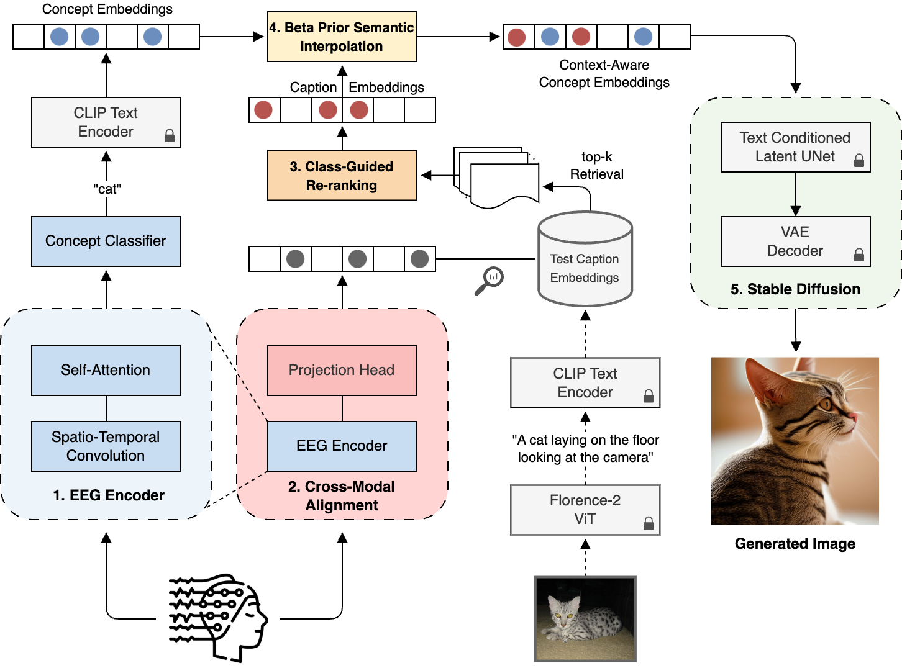
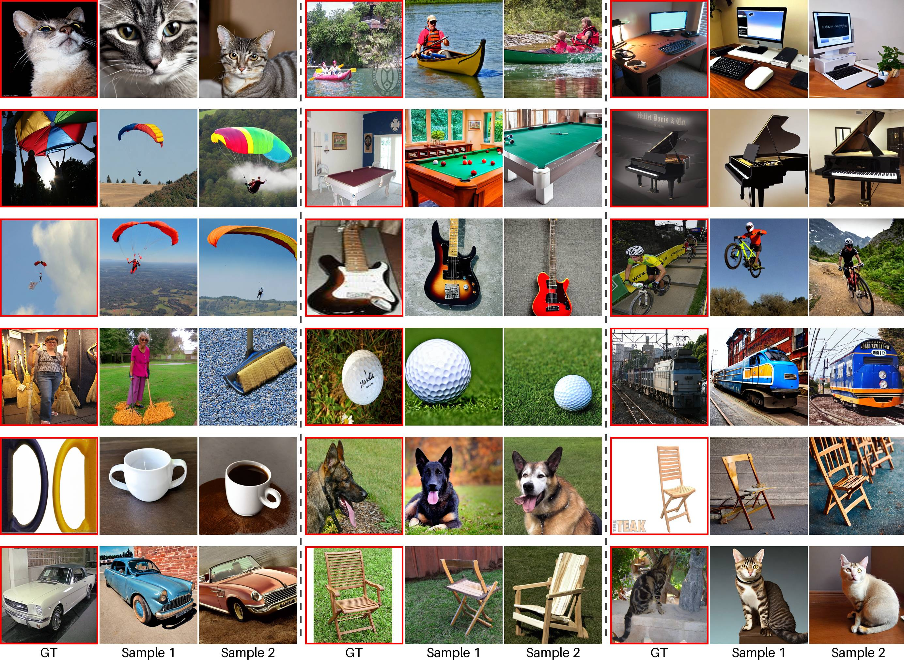

# CATVis: Context-Aware Thought Visualization

This repository contains the implementation of the CATVis (Context-Aware Thought Visualization) research project for generating images from EEG brain signals.



## Abstract

EEG-based brain-computer interfaces (BCIs) have shown promise in various applications, such as motor imagery and cognitive state monitoring. However, decoding visual representations from EEG signals remains a significant challenge due to their complex and noisy nature. We thus propose a novel 5-stage framework for decoding visual representations from EEG signals: (1) an EEG encoder for concept classification, (2) cross-modal alignment of EEG and text embeddings in CLIP feature space, (3) caption refinement via re-ranking, (4) weighted interpolation of concept and caption embeddings for richer semantics, and (5) image generation using a pre-trained Stable Diffusion model. We enable context-aware EEG-to-image generation through cross-modal alignment and re-ranking. Experimental results demonstrate that our method generates high-quality images aligned with visual stimuli, outperforming SOTA approaches by 27.08% in Classification Accuracy, 15.21% in Generation Accuracy and reducing Fréchet Inception Distance by 36.61%, indicating superior semantic alignment and image quality.



## Repository Structure

```
CATVis/
├── README.md
├── requirements.txt
├── config/
│   └── config.yaml
├── data/
│   └── README.md (instructions for data placement)
├── src/
│   ├── __init__.py
│   ├── data/
│   │   ├── __init__.py
│   │   ├── data_loader.py
│   │   └── preprocessor.py
│   ├── models/
│   │   ├── __init__.py
│   │   ├── eeg_classifier.py
│   │   └── contrastive_encoder.py
│   ├── training/
│   │   ├── __init__.py
│   │   ├── train_classifier.py
│   │   └── train_contrastive.py
│   ├── pipeline/
│   │   ├── __init__.py
│   │   ├── image_generator.py
│   │   └── retrieval.py
│   └── evaluation/
│       ├── __init__.py
│       └── metrics.py
├── scripts/
│   ├── train_eeg_classifier.py
│   ├── train_contrastive_model.py
│   ├── run_pipeline.py
│   └── evaluate_results.py
└── checkpoints/
    └── README.md
```

## Pipeline Overview

1. **EEG Classification**: Train EEGConformer model for 40-class classification
2. **Contrastive Alignment**: Train EEG-text alignment using CLIP embeddings  
3. **Image Generation**: Use trained models in Stable Diffusion pipeline
4. **Evaluation**: Compute metrics (FID, IS, Classification Accuracy)

## Setup Instructions

1. Install dependencies: `pip install -r requirements.txt`
2. Place data files in `data/` directory (see data/README.md)
3. Run training scripts in order
4. Execute pipeline and evaluation

## Usage

### 1. Train Models

```bash
# Train EEG classifier (required first)
python scripts/train_eeg_classifier.py

# Train contrastive model (required second)
python scripts/train_contrastive_model.py
```

### 2. Test Existing Models

```bash
# Test existing EEG classifier checkpoint
python scripts/train_eeg_classifier.py --test-only

# Test existing contrastive model checkpoint
python scripts/train_contrastive_model.py --test-only

# Test with custom checkpoint path
python scripts/train_eeg_classifier.py --test-only --checkpoint /path/to/model.pth
python scripts/train_contrastive_model.py --test-only --checkpoint /path/to/model.pth
```

**Note**: Both training and test-only modes will generate output files (test results, training curves when applicable) in the `outputs/` directory.

### 3. Run Image Generation Pipeline

```bash
# Generate images for all subjects
python scripts/run_pipeline.py

# Generate for specific subjects only
python scripts/run_pipeline.py --subjects "1,2,4"

# Test run with limited batches
python scripts/run_pipeline.py --max-batches 5

# Dry run (setup only, no generation)
python scripts/run_pipeline.py --dry-run
```

### 4. Evaluate Results

```bash
# Run all evaluation metrics
python scripts/evaluate_results.py

# Evaluate specific results directory
python scripts/evaluate_results.py --results-dir ./custom_results

# Run only generation metrics (skip classification)
python scripts/evaluate_results.py --metrics generation
```

### 5. Clean Up Generated Files

```bash
# Remove outputs directory (default - safe and simple)
python cleanup.py

# Remove only CATVis model checkpoints
python cleanup.py --mode checkpoints

# Remove both outputs and CATVis checkpoints
python cleanup.py --mode all

# See what would be removed without actually removing
python cleanup.py --dry-run
```

**Cleanup Modes:**
- `outputs`: Remove entire outputs/ directory (training curves, results, generated images, etc.)
- `checkpoints`: Remove only CATVis model checkpoints (eeg_classifier_best.pth, contrastive_model_best.pth)  
- `all`: Remove both outputs directory and CATVis checkpoints

**Note**: The `checkpoints` mode only removes CATVis-specific checkpoints, preserving any other .pth files you may have.

### Custom Configuration

All scripts accept a `--config` parameter to specify custom configuration:

```bash
python scripts/train_eeg_classifier.py --config custom_config.yaml
```

## Research Paper

[Link to paper when published] 